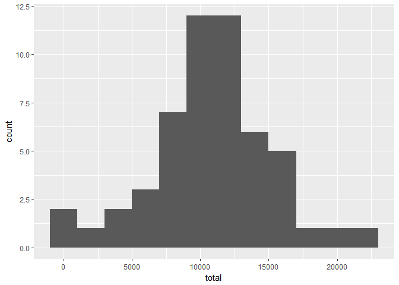
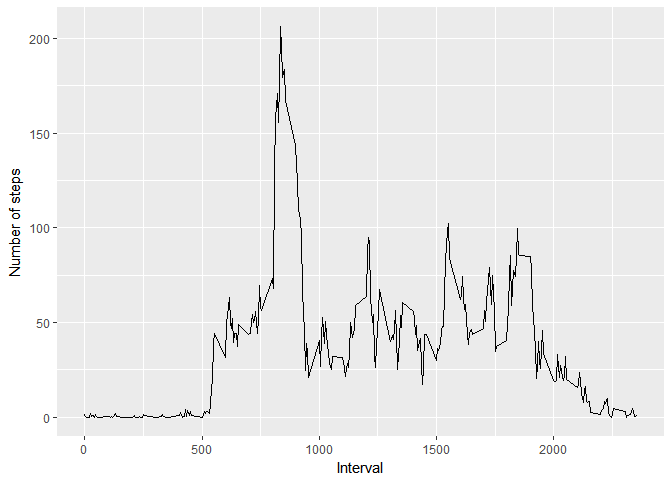
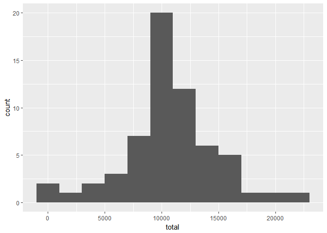
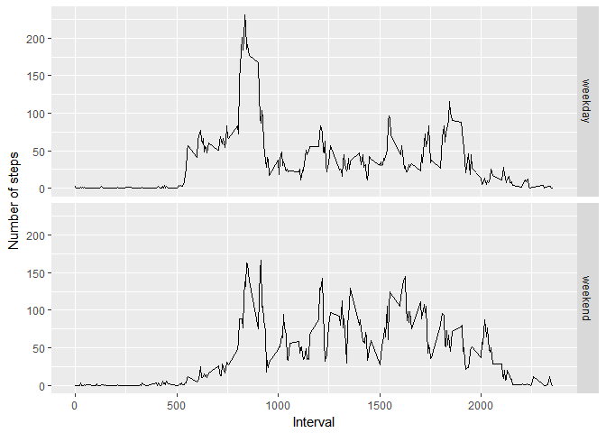

# Reproducible Research: Peer Assessment 1


## Loading and preprocessing the data

```r
knitr::opts_chunk$set(echo = TRUE)
data = read.csv(unz("activity.zip", "activity.csv"))
head(data)
```

```
##   steps       date interval
## 1    NA 2012-10-01        0
## 2    NA 2012-10-01        5
## 3    NA 2012-10-01       10
## 4    NA 2012-10-01       15
## 5    NA 2012-10-01       20
## 6    NA 2012-10-01       25
```


## What is mean total number of steps taken per day?
Let's make a histogram of the total number of steps taken each day first


```r
library(dplyr)
library(ggplot2)
daily <- data %>%
  group_by(date) %>%
  summarise(total=sum(steps))
  
g <- ggplot(daily, aes(total)) +  geom_histogram(binwidth = 2000)
print(g)
```

```
## Warning: Removed 8 rows containing non-finite values (stat_bin).
```

<!-- -->

Now, calculate the the **mean** and **median** total number of steps taken per day


```r
mean(daily$total, na.rm = TRUE)
```

```
## [1] 10766.19
```

```r
median(daily$total, na.rm = TRUE)
```

```
## [1] 10765
```


## What is the average daily activity pattern?
We can make a time series plot of the 5-minute interval (x-axis) and the average number of steps taken, averaged across all days (y-axis)


```r
by_interval <- data %>% 
  group_by(interval) %>% 
  summarise(ave = mean(steps, na.rm=T))
            
g <- ggplot(by_interval, aes(interval, ave)) + geom_line() + xlab("Interval") + ylab("Number of steps")
print(g)
```

<!-- -->

The interval when the maximum steps were taken can be found as

```r
max_step <- max(by_interval$ave)
interval_m <- which.max(by_interval$ave)
print(paste("on ", by_interval$interval[interval_m],"th interval, we see ", max_step, "steps"))
```

```
## [1] "on  835 th interval, we see  206.169811320755 steps"
```


## Imputing missing values
First, let check how many rows contain NA

```r
sum(is.na(data$steps))
```

```
## [1] 2304
```

Now let's fill the missing values with the average steps for that interval


```r
impute.mean <- function(x) replace(x, is.na(x), mean(x, na.rm = TRUE))
data_new <- data %>% 
  group_by(interval) %>% 
  mutate(steps = impute.mean(steps))
```
Then, the histogram, and mean and median steps of total number of steps taken per day are updated

```r
daily2 <- data_new %>%
  group_by(date) %>%
  summarise(total = sum(steps))
            
g <- ggplot(daily2, aes(total)) + geom_histogram(binwidth = 2000)
print(g)
```

<!-- -->

```r
mean(daily2$total)
```

```
## [1] 10766.19
```

```r
median(daily2$total)
```

```
## [1] 10766.19
```

After removing missing values, the mean value does not change because the approach to replace missing values by average daily steps have no effect on the average itself.
The median value change to be the same as the average because now there are possibly many data point with average value therefore increase the possibility to observe the median right at average values.

## Are there differences in activity patterns between weekdays and weekends?
Firstly, we need to create a factor recording whether a date is weekdays or weekend

```r
weekdays1 <- c('Monday', 'Tuesday', 'Wednesday', 'Thursday', 'Friday')
data_new$weekdays <- c('weekend', 'weekday')[(weekdays(as.Date(data_new$date)) %in% weekdays1)+1L]
```

Then, we make a panel plot containing a time series plot (i.e. type = "l") of the 5-minute interval (x-axis) and the average number of steps taken, averaged across all weekday days or weekend days (y-axis)


```r
by_interval2 <- data_new %>% 
  group_by(interval, weekdays) %>% 
  summarise(ave = mean(steps))
            
t <- ggplot(by_interval2, aes(interval, ave)) + geom_line()
t + facet_grid(weekdays~.) + xlab("Interval") + ylab("Number of steps")
```

<!-- -->
It seems the activity pattern changes somewhat when we compared weekday and weekend. Generally, less steps were taken during weekend days 

